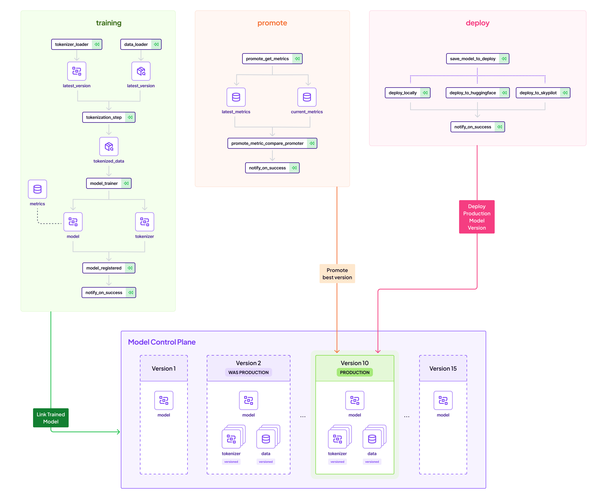
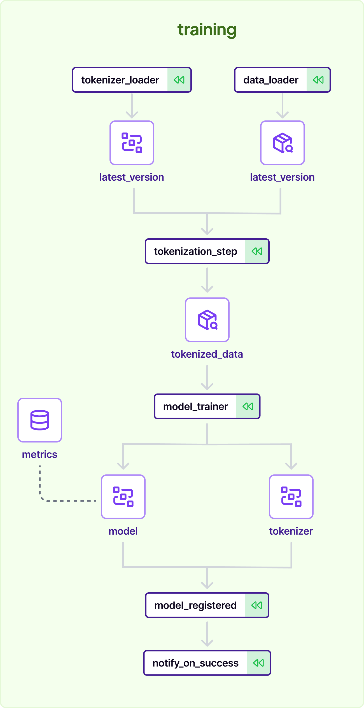
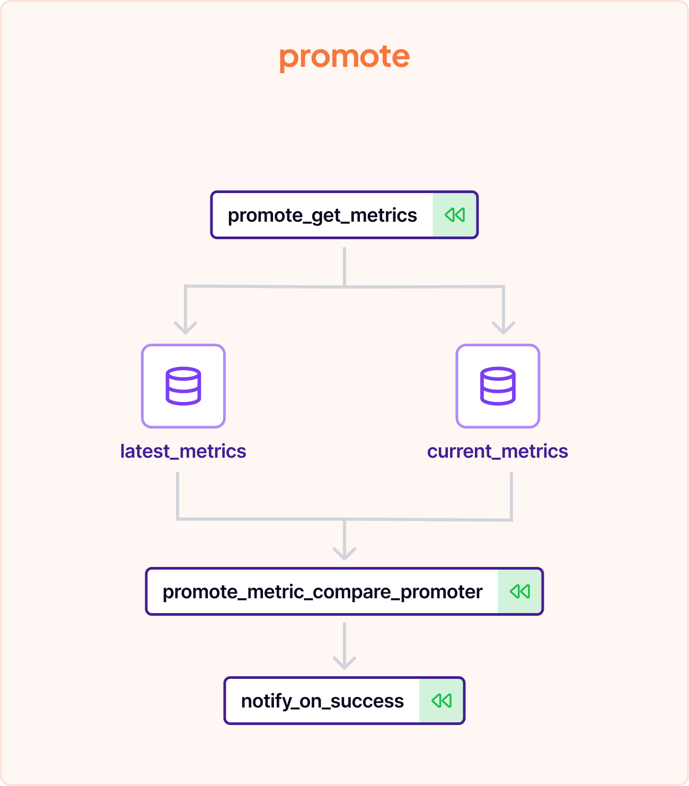
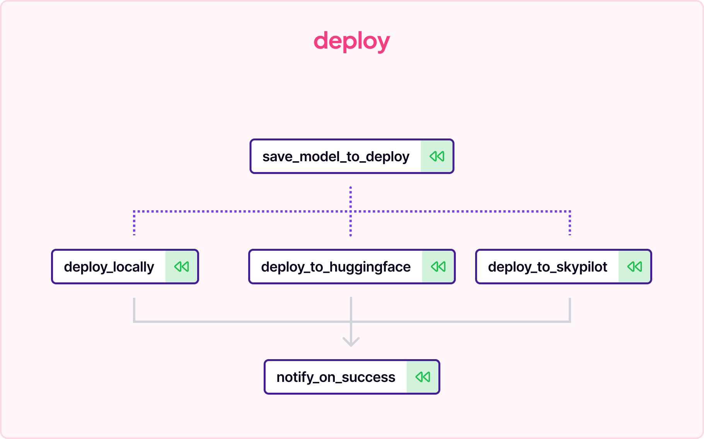

# 🌟 ZenML End-to-End NLP Training, Promotion, and Deployment Project Template

Welcome to the ZenML NLP project template, a comprehensive starting point for anyone looking to build and deploy NLP models using the ZenML framework. This template is designed to streamline the process of training, promoting, and deploying NLP models with a focus on reproducibility, scalability, and ease of use.

## 🚀 Quickstart

To get started with this template, you'll need to have ZenML installed along with the necessary extras for NLP:

```bash
pip install zenml[templates]
```

Once you have ZenML installed, you can initialize a new project using this template:

```bash
zenml init --template <short_name_of_template>
# example: zenml init --template template-nlp
```

Running the command above will result in input prompts being shown to you. If you would like to rely on default values for the ZenML project template - you can add --template-with-defaults to the same command, like this:

```bash
zenml init --template <short_name_of_template> --template-with-defaults
# example: zenml init --template template-nlp --template-with-defaults
```


## 📃 Template Parameters

The template can be configured using the following parameters:

| Parameter | Description | Default |
|-----------|-------------|---------|
| Project Name | Short name for your project | ZenML NLP project |
| Project Version | The version of your project | 0.0.1 |
| Project License | The license under which your project will be released | Apache Software License 2.0 |
| Full Name | The name of the copyright holder | ZenML GmbH |
| Email | The email of the copyright holder | info@zenml.io |
| Product Name | The technical name for your NLP product | nlp_use_case |
| Target Environment | The target environment for deployments | staging |
| Accelerator | The accelerator to use for training | gpu |
| Deploy Locally | Whether to deploy the model locally | True |
| Deploy to HuggingFace | Whether to deploy to HuggingFace Hub | False |
| Deploy to SkyPilot | Whether to deploy to SkyPilot | False |
| Dataset | The dataset to use from HuggingFace Datasets | airline_reviews |
| Model | The model to use from HuggingFace Models | roberta-base |
| Cloud Provider | The cloud provider to use (AWS or GCP) | aws |
| Metric-Based Promotion | Whether to promote models based on metrics | True |
| Notifications on Failure | Whether to notify about pipeline failures | True |
| Notifications on Success | Whether to notify about pipeline successes | False |
| ZenML Server URL | URL of a remote ZenML server (optional) | |

After configuring your project, you can run the following commands to set up your environment and start the ZenML Dashboard:

```bash
cd <your_project_directory>
make setup
make install-local-stack
zenml up
python run.py
```

For more details, check the `README.md` file in the generated project directory.

## 🛠️ Project Structure

This NLP project template includes three main pipelines:

<p align="center">
  
</p>

### Training Pipeline

The training pipeline is designed to handle the end-to-end process of training an NLP model. It includes steps for data loading, tokenization, model training, and model registration. The pipeline is parameterized to allow for customization of the training process, such as sequence length, batch size, and learning rate.

### Promotion Pipeline

The promotion pipeline is responsible for promoting a model version to a specified stage. It can be configured to promote based on a metric comparison between the latest and currently promoted model versions or to simply promote the latest model version.

### Deployment Pipeline

The deployment pipeline handles the deployment of the model to various environments. It can be configured to deploy locally, to HuggingFace Hub, or to SkyPilot, depending on your requirements.

## 📚 Core Concepts

This template showcases several core concepts of ZenML:

- Designing and running ZenML pipelines for NLP tasks.
- Parameterizing steps for flexibility and reusability.
- Model promotion strategies based on metrics or latest versions.
- Deploying models to different environments, including local and cloud-based platforms.
- Best practices for implementing and running reproducible and reliable ML pipelines with ZenML.

## 📦 Additional Features

- Integration with HuggingFace Datasets and Models for easy access to pre-trained models and datasets.
- Support for different accelerators (GPU/CPU) to speed up training.
- Conditional deployment steps based on user configuration.
- Notification hooks for pipeline successes and failures.

## 🌐 Deployment Options

The template supports multiple deployment options, including local deployment for testing and cloud-based deployment for production use. You can choose to deploy to HuggingFace Hub for easy sharing and collaboration or to SkyPilot for managed deployment services.

## 📋 License

This project is licensed under the Apache License 2.0, ensuring that you have the freedom to use, modify, and distribute the software as you see fit.

### 🛠️ How this template is implemented

Let's dive into the implementation details and share some tips and best practices for using this template effectively.

### Training Pipeline

The training pipeline is the heart of the NLP project. It is responsible for preparing the data, training the model, and registering the model in the model registry. The pipeline is designed to ensure that only models that meet quality standards are promoted for inference.

The training pipeline is configured using the `{{product_name}}_training_pipeline` function, which includes steps for data loading, tokenization, model training, and model registration. The pipeline can be customized with parameters such as `lower_case`, `padding`, `max_seq_length`, and others to tailor the tokenization and training process to your specific NLP use case.

### Training Pipeline

[📂 Code folder](template/steps/model_training/)
<p align="center">
  
</p>

The first stage of the training pipeline involves loading the dataset and preparing it for the model. The `data_loader` step fetches the dataset, which is then passed to the `tokenizer_loader` and `tokenization_step` to convert the raw text data into a format suitable for the NLP model.

Tokenization is a critical step in NLP pipelines, as it converts text into tokens that the model can understand. The tokenizer can be configured to handle case sensitivity, padding strategies, and sequence lengths, ensuring that the input data is consistent and optimized for training.

Once the data is tokenized, the `model_trainer` step takes over to train the NLP model. This step utilizes the tokenized dataset and the tokenizer itself to fine-tune the model on the specific task, such as sentiment analysis, text classification, or named entity recognition.

The model training step can be configured with parameters like `train_batch_size`, `eval_batch_size`, `num_epochs`, `learning_rate`, and `weight_decay` to control the training process. After training, the model is evaluated, and if it meets the quality criteria, it is registered in the model registry with a unique name.

### Promotion Pipeline

[📂 Code folder](template/steps/promotion/)
<p align="center">
  
</p>

The promotion pipeline is responsible for promoting the best model to the chosen stage, such as Production or Staging. The pipeline can be configured to promote models based on metric comparison or simply promote the latest model version.

The `{{product_name}}_promote_pipeline` function orchestrates the promotion process. If `metric_compare_promotion` is enabled, the pipeline retrieves the metrics for the latest and currently promoted model versions and compares them to decide which model to promote.

### Deployment Pipeline

[📂 Code folder](template/steps/deployment/)
<p align="center">
  
</p>

The deployment pipeline handles the deployment of the model to various environments. It can be configured to deploy locally, to HuggingFace Hub, or to SkyPilot, depending on the project's needs.

The `{{product_name}}_deploy_pipeline` function manages the deployment process, which includes saving the model locally and deploying it to the chosen target. The pipeline can be customized with parameters like `labels`, `title`, `description`, `model_name_or_path`, and others to provide metadata for the deployed model.

### 📝 Configuration and Customization

The template can be configured using the provided YAML configuration file. You can specify the project name, version, license, target environment, dataset, model, cloud provider, and other options to tailor the template to your specific requirements.

### 📚 Further Reading

For more information on ZenML and how to use it for NLP projects, check out the [ZenML Documentation](https://docs.zenml.io/). You'll find guides on pipelining, stack management, and best practices for MLOps.

Happy coding, and may your NLP models be ever accurate and insightful!

## 📩 Contact

For any questions or support, please reach out to ZenML GmbH at info@zenml.io.
